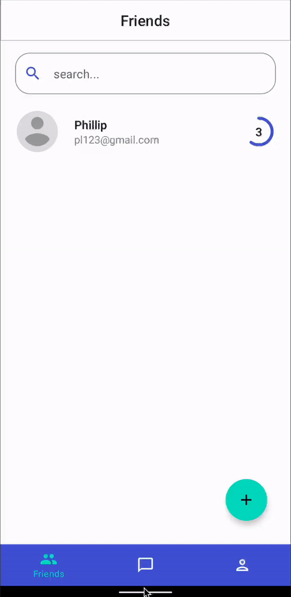
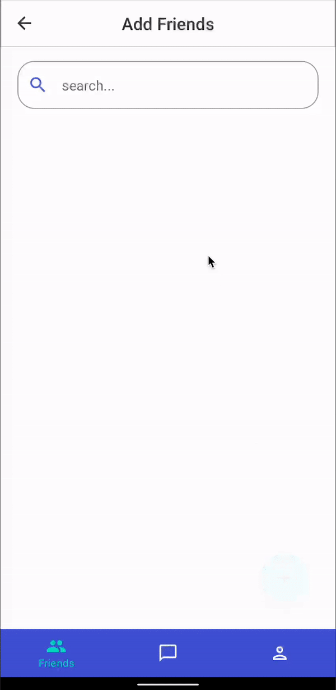
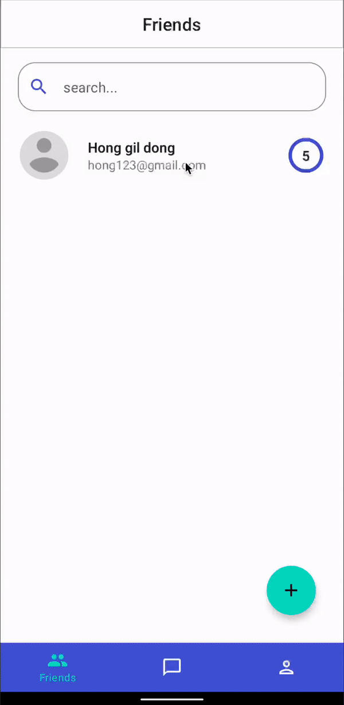
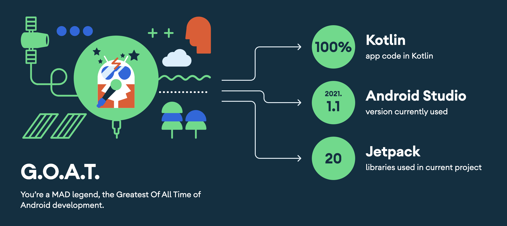

# Private Chat App

Private Chat App is an Application based on Modern Android tech-stacks focus on Jetpack Compose UI and Ktor. Chat with friends without server database. However, if you want to receive messages, you need to keep the application installed. 

## Features

Basic sign up and sign in process and you can keep session even when app is closed. 




You can find, add, and prioritize friends.



You can chat with the added friend. However, if the app is not installed&#40;Service is not running&#41;, you can't receive messages.



You can set up your profile image and settings.


## Tech stacks & Libraries

- [Kotlin](https://developer.android.com/kotlin) based, [Kotlin Flow](https://developer.android.com/kotlin/flow) + [Kotlin Coroutines](https://github.com/Kotlin/kotlinx.coroutines) for asynchronous.
- [Material Components](https://github.com/material-components/material-components-android) - Material design library.
- [Dagger Hilt](https://dagger.dev/hilt/) - Dependency injection library.
- [Android Jetpack](https://developer.android.com/jetpack)
    - [Navigation Compose](https://developer.android.com/jetpack/compose/navigation) - Navigate between composables.
    - [ViewModel](https://developer.android.com/topic/libraries/architecture/viewmodel) - Stores UI-related data that is lifecycle aware (didn't destroyed on UI changes).
    - [Room](https://developer.android.com/training/data-storage/room) - ORM which wraps android's native SQLite database.
- [Coil](https://github.com/coil-kt/coil) - Load images from network.
- [Retrofit](https://square.github.io/retrofit/) & [OkHttp3](https://square.github.io/okhttp/) - Construct REST APIs.
- [Kotlinx Serialization](https://github.com/Kotlin/kotlinx.serialization) - Kotlin serialize, deserialize library.
- [Accompanist](https://google.github.io/accompanist/insets/)
    - [System UI Controller](https://google.github.io/accompanist/systemuicontroller/) - To control system UI in composable.
    - [Swipe Refresh](https://google.github.io/accompanist/swiperefresh/)
    - [Permissions](https://google.github.io/accompanist/permissions/)
- [Data Store](https://developer.android.com/topic/libraries/architecture/datastore) - To save user token.
- [Android Architecture Components](https://developer.android.com/topic/architecture)
    - MVVM Architecture (Declarative UI - ViewModel - Use Case - Model)
    - Repository pattern
- [swipe](https://github.com/saket/swipe)
- Feature-Based Multi Module Architecture

## MAD Score



## API

Using [Ktor server's API](https://github.com/beomsu317/private-chat-server). You can check the contents of the API in this repository.


## License

```
Copyright 2022 beomsu317

Licensed under the Apache License, Version 2.0 (the "License");
you may not use this file except in compliance with the License.
You may obtain a copy of the License at

    http://www.apache.org/licenses/LICENSE-2.0

Unless required by applicable law or agreed to in writing, software
distributed under the License is distributed on an "AS IS" BASIS,
WITHOUT WARRANTIES OR CONDITIONS OF ANY KIND, either express or implied.
See the License for the specific language governing permissions and
limitations under the License.
```
